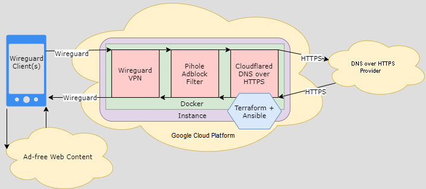

# Reference
End-to-end DNS encryption with DNS-based ad-blocking. Combines wireguard (DNS VPN), pihole (adblock), and cloudflared (DNS over HTTPS). Built in GCP with a low-cost instance using Terraform, Ansible, and Docker.



# Requirements
- Terraform installed.
- GCP authorization, e.g.: `gcloud auth application-default login`
- Customized variables (see Variables section).

# Variables
Edit the vars file (ph.tfvars) to customize the deployment, especially:

```
# pihole_password
# password to access the pihole webui

# mgmt_cidr
# an IP range granted webUI, EC2 SSH access. Also permitted PiHole DNS if dns_novpn = 1 (default).
# deploying from home? This should be your public IP address with a /32 suffix. 

# ssh_key
# a public SSH key for SSH access to the instance via user `ubuntu`.

# gcp_billing_account
# The billing account ID the project lives under, see:
gcloud beta billing accounts list | grep True

# gcp_user
# The GCP user, see:
gcloud auth list
```

# Deploy
```
# Clone and change to directory
git clone https://github.com/chadgeary/gcp_pihole && cd gcp_pihole

# Initialize terraform
terraform init

# Apply terraform - the first apply takes a while creating an encrypted AMI.
terraform apply -var-file="ph.tfvars"
```

# Post-Deployment
- See terraform output for VPN Client configuration link and the Pihole WebUI address.
