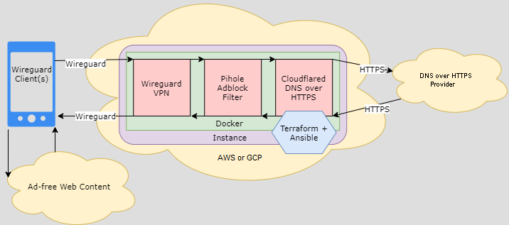

# Reference
End-to-end DNS encryption with DNS-based ad-blocking. Combines wireguard (DNS VPN), pihole (adblock), and cloudflared (DNS over HTTPS). Built in AWS with a lightsail instance using Terraform, Ansible, and Docker.



# Requirements
- An AWS account
- Follow Step-by-Step (compatible with Windows and Ubuntu)

# Step-by-Step 
Mac Users install (home)brew, then terraform, git, awscli.
```
#########
## Mac ##
#########
# Launch terminal

# Install brew
/bin/bash -c "$(curl -fsSL https://raw.githubusercontent.com/Homebrew/install/HEAD/install.sh)"

# Ensure brew up-to-date
brew update

# Install terraform and git
brew install terraform git

# Install awscli
curl "https://awscli.amazonaws.com/AWSCLIV2.pkg" -o "AWSCLIV2.pkg"
sudo installer -pkg AWSCLIV2.pkg -target /

# Verify the three are installed
which terraform git aws

# Skip down to 'git clone' below
```


Windows Users install WSL (Windows Subsystem Linux)
```
#############################
## Windows Subsystem Linux ##
#############################
# Launch an ELEVATED Powershell prompt (right click -> Run as Administrator)

# Enable Windows Subsystem Linux
dism.exe /online /enable-feature /featurename:Microsoft-Windows-Subsystem-Linux /all /norestart

# Reboot your Windows PC
shutdown /r /t 5

# After reboot, launch a REGULAR Powershell prompt (left click).
# Do NOT proceed with an ELEVATED Powershell prompt.

# Download the Ubuntu 1804 package from Microsoft
curl.exe -L -o ubuntu-1804.appx https://aka.ms/wsl-ubuntu-1804
 
# Rename the package
Rename-Item ubuntu-1804.appx ubuntu-1804.zip
 
# Expand the zip
Expand-Archive ubuntu-1804.zip ubuntu-1804
 
# Change to the zip directory
cd ubuntu-1804
 
# Execute the ubuntu 1804 installer
.\ubuntu1804.exe
 
# Create a username and password when prompted
```
Install Terraform, Git, and create an SSH key pair
```
#############################
##  Terraform + Git + SSH  ##
#############################
# Add terraform's apt key (enter previously created password at prompt)
curl -fsSL https://apt.releases.hashicorp.com/gpg | sudo apt-key add -
 
# Add terraform's apt repository
sudo apt-add-repository "deb [arch=amd64] https://apt.releases.hashicorp.com $(lsb_release -cs) main"
 
# Install terraform and git
sudo apt-get update && sudo apt-get -y install terraform git
 
# Clone the cloudblock project
git clone https://github.com/chadgeary/cloudblock

# Create SSH key pair (RETURN for defaults)
ssh-keygen
```

Install the AWS cli and create non-root AWS user. An [AWS account](https://portal.aws.amazon.com/billing/signup) is required to continue.
```
#############################
##          AWS            ##
#############################
# Open powershell and start WSL
wsl

# Change to home directory
cd ~

# Install python3 pip
sudo apt update && sudo DEBIAN_FRONTEND=noninteractive apt-get -q -y install python3-pip

# Install awscli via pip
pip3 install --user --upgrade awscli

# Create a non-root AWS user in the AWS web console with admin permissions
# This user must be the same user running terraform apply
# Create the user at the AWS Web Console under IAM -> Users -> Add user -> Check programmatic access and AWS Management console -> Attach existing policies -> AdministratorAccess -> copy Access key ID and Secret Access key
# See for more information: https://docs.aws.amazon.com/IAM/latest/UserGuide/getting-started_create-admin-group.html#getting-started_create-admin-group-console

# Set admin user credentials
~/.local/bin/aws configure

# Validate configuration
~/.local/bin/aws sts get-caller-identity 
```

Customize the deployment - See variables section below
```
# Change to the project's lightsail directory in powershell
cd ~/cloudblock/lightsail/

# Open File Explorer in a separate window
# Navigate to aws project directory - change \chad\ to your WSL username
%HOMEPATH%\ubuntu-1804\rootfs\home\chad\cloudblock\aws

# Edit the aws.tfvars file using notepad and save
```

Deploy
```
# In powershell's WSL window, change to the project's aws directory
cd ~/cloudblock/lightsail/

# Initialize terraform and apply the terraform state
terraform init
terraform apply -var-file="aws.tfvars"

# If permissions errors appear, fix with the below command and re-run the terraform apply.
sudo chown $USER aws.tfvars && chmod 600 aws.tfvars

# Note the outputs from terraform after the apply completes

# Wait for the virtual machine to become ready (Ansible will setup the services for us)
```

Want to watch Ansible setup the virtual machine? SSH to the cloud instance - see the terraform output.
```
# Connect to the virtual machine via ssh
ssh ubuntu@<some ip address terraform told us about>

# Check the Ansible output (from AWS SSM)
export ASSOC_ID=$(sudo bash -c 'ls -t /var/lib/amazon/ssm/*/document/orchestration/' | awk 'NR==1 { print $1 }') && sudo bash -c 'cat /var/lib/amazon/ssm/mi-*/document/orchestration/'"$ASSOC_ID"'/awsrunShellScript/runShellScript/stdout'
```

Alternatively, check [AWS State Manager](https://console.aws.amazon.com/systems-manager/state-manager) though you'll need to be logged into AWS as the user created in the previous AWS steps. 

# Variables
Edit the vars file (aws.tfvars) to customize the deployment, especially:
```
# pihole_password
# password to access the pihole webui

# instance_key
# a public SSH key for SSH access to the instance via user `ubuntu`.
# cat ~/.ssh/id_rsa.pub

# mgmt_cidr
# an IP range granted webUI, EC2 SSH access. Also permitted PiHole DNS if dns_novpn = 1 (default).
# deploying from home? This should be your public IP address with a /32 suffix.

# kms_manager
# The AWS username (not root) granted access to read the Wireguard VPN configuration files in S3.
```

# Post-Deployment
- Wait for Ansible Playbook, watch [AWS State Manager](https://console.aws.amazon.com/systems-manager/state-manager)
- See terraform output for VPN Client configuration link and the Pihole WebUI address.

# Updates
- See the notes from `terraform output` for aws-specific update instructions.
- Important note, if you are familiar with a traditional pihole deployment keep in mind cloudblock uses the docker container which does not follow the same
update path. Cloudblock follows the official pihole (and wireguard) container update instructions:
  - [Pihole](https://github.com/pi-hole/docker-pi-hole#upgrading-persistence-and-customizations)
  - [Wireguard](https://github.com/linuxserver/docker-wireguard)

# FAQs
- Want to reach the PiHole webUI while away?
  - Connect to the Wireguard VPN and browse to Pihole VPN IP in the terraform output ( by default, its https://172.18.0.5/admin/ - for older installations its http://172.18.0.3/admin/ ).

- Using an ISP with a dynamic IP (DHCP) and the IP address changed? Pihole webUI and SSH access will be blocked until the mgmt_cidr is updated.
  - Follow the steps below to quickly update the cloud firewall using terraform.

```
# Open Powershell and start WSL
wsl

# Change to the project directory
cd ~/cloudblock/lightsail/

# Update the mgmt_cidr variable - be sure to replace change_me with your public IP address
sed -i -e "s#^mgmt_cidr = .*#mgmt_cidr = \"change_me/32\"#" aws.tfvars

# Rerun terraform apply, terraform will update the cloud firewall rules
terraform apply -var-file="aws.tfvars"
```
